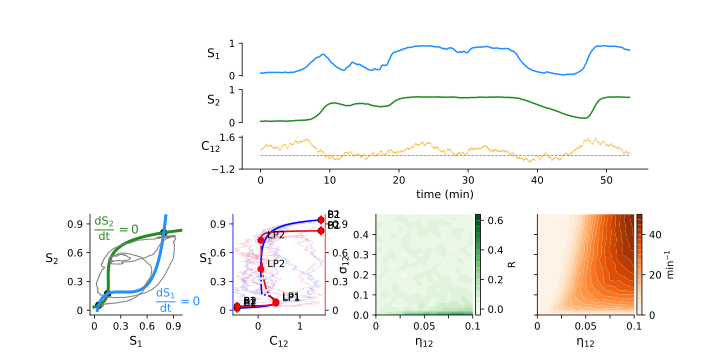

Dynamical system analysis
=========================

This section presents the code implemented for the analysis of the Reduced Wong Wang model `(Wong & Wang, 2006)`_ 
using `PyDSTool`_ `(Clewley et al., 2012)`_.

Script overview
---------------

The main part of the dynamical system analysis code is in ``OCD_modeling.analysis.rww_dst_analysis.py``.
The script can be run with the following options:

.. argparse::
  :module: OCD_modeling.analysis
  :func: get_parser
  :prog: python rww_dst_analysis.py
  :nodefaultconst:

Reduced Wong-Wang Model
-----------------------

First, we instanciate the Reduced Wong-Wang model `(Wong & Wang, 2006)`_ in `PyDSTool`_ `(Clewley et al., 2012)`_ 
following the implementation provided in Deco et al. `(Deco et al., 2013)`_:

.. autofunction:: OCD_modeling.analysis.create_model

.. list-table:: Default model's paremeters
    :widths: 20 20 60
    :header-rows: 1

    * - Parameter
      - Value
      - (unit) Interpretation
    * - :math:`a`
      - 270
      - (n/C) slope of the transfer function
    * - :math:`b`
      - 108
      - (Hz) offset of the transfer function
    * - :math:`d`
      - 0.154
      - (s) decay of the transfer function
    * - :math:`G`
      - 2.5
      - (N/A) global coupling gain of the system
    * - :math:`J_N`
      - 0.2609
      - (nA) synaptic scaling factor
    * - :math:`I_0`
      - 0.3
      - (nA) external input
    * - :math:`\tau_S`
      - 0.1
      - (s) timescale of the local population activity
    * - :math:`\gamma`
      - 0.000641
      - (Hz) timescale of the coupled activity
    * - :math:`w`
      - 0.9
      - (N/A) recurrent excitation factor
    * - :math:`\sigma`
      - 0.01
      - (nA) noise amplitude

Stability analysis
------------------

The stability analysis involves 3 major steps, which are executed for each single discretization of the order parameters:

1) Compute the nullclines (where each state variable is at equilibrium) and finding the fixed points (where nullclines cross).
2) Compute trajectories to illustrate the system behavior in the phase space (optional).
3) Compute equilibrium point curves. These are the branches of the bifurcation diagram indicating stability regimes and transition types.

.. autofunction:: OCD_modeling.analysis.stability_analysis

.. autofunction:: OCD_modeling.analysis.get_fixed_points

.. autofunction:: OCD_modeling.analysis.compute_trajectories

.. autofunction:: OCD_modeling.analysis.compute_equilibrium_point_curve

Parallel processing
-------------------

Since we conducted the stability analysis while varying coupling parameters, 
we wrapped the stability analysis from the section above such that we can parallelize 
its execution with custom ranges of parameters. 

.. autofunction:: OCD_modeling.analysis.run_stability_analysis

.. autofunction:: OCD_modeling.analysis.launch_stability_analysis

Plotting
--------

We visualized phase space topology via a wrapper of `PyDSTool`_ functions to plot fixed points and vector fields, \
and customed plotting of nullclines:

.. autofunction:: OCD_modeling.analysis.plot_phasespace

It can then be called multiple times to plot grids of phase spaces as in Supplementary Section I.

.. autofunction:: OCD_modeling.analysis.plot_phasespace_grid

.. figure:: img/numeric_state_space_20240214-01.svg
  :width: 1000
  :align: center

  Grid of phase space with fixed point, nullclines and trajectories for different values of couplings.

.. autofunction:: OCD_modeling.analysis.plot_bifurcation_row

  Bifurcation diagrams of the model variables :math:`S1`, :math:`S2` with free parameter :math:`C_{12}` and 
  order parameter :math:`C_{21}`. 
  Lines denote equilibrium point curves (plain: stable, dash: unstable); LP: saddle-node points (i.e. `LimitPoint`), 
  B: Boundary point (bound values of the analysis).

.. autofunction:: OCD_modeling.analysis.plot_timeseries_phasespace_bif

  Timeseries of the model variables :math:`S1`, :math:`S2` and stochastic coupling :math:`C_{12}`, with corresponding projections 
  in :math:`S1-S2` state space, bifurcation diagram with free parameter :math:`C_{12}`, transition rates and frontostriatal 
  functional connectivity (FC) according to :math:`\eta_{12}` and :math:`\sigma_{12}` parameters. 
  *Note that transition rates and FC were precomputed separately and loaded for visualization only.* 

.. _`PyDSTool`: https://github.com/robclewley/pydstool 
.. _`(Clewley et al., 2012)`:  https://journals.plos.org/ploscompbiol/article?id=10.1371/journal.pcbi.1002628
.. _`(Deco et al., 2013)`: https://www.jneurosci.org/content/33/27/11239.short
.. _`(Wong & Wang, 2006)`: https://www.jneurosci.org/content/26/4/1314

