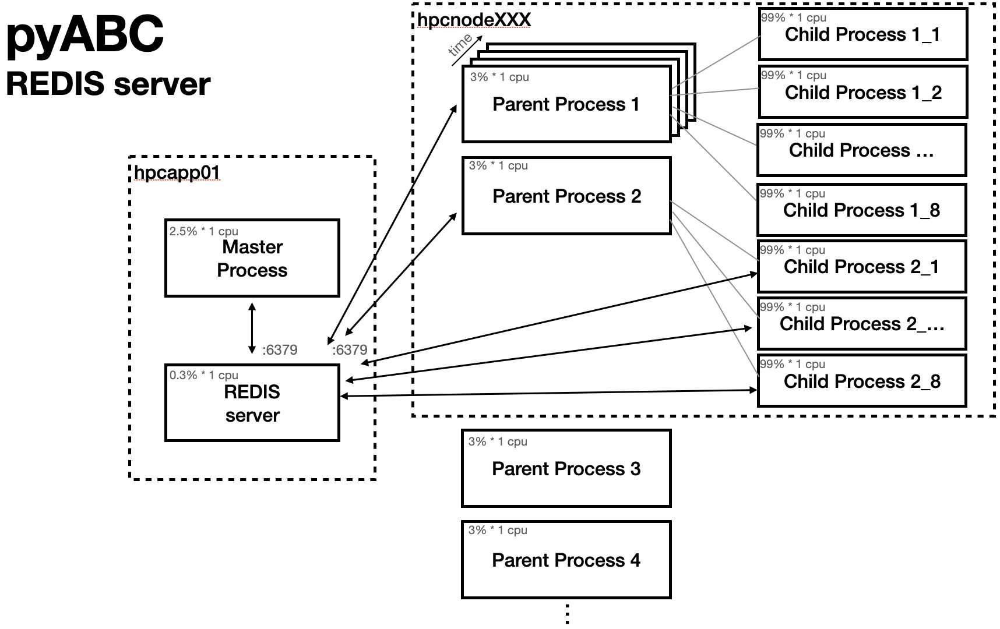
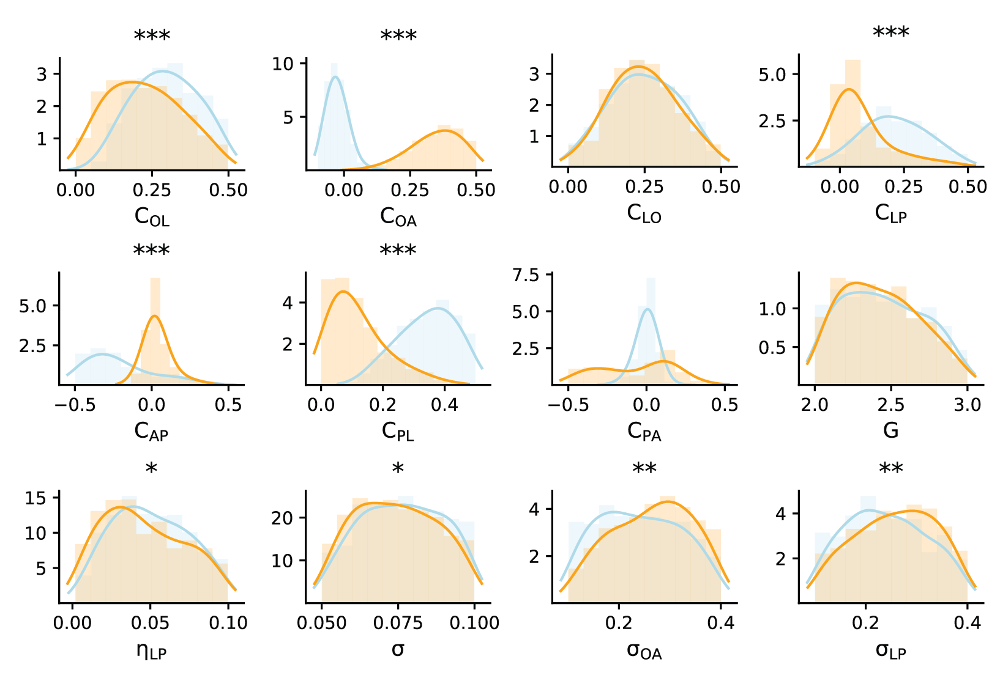
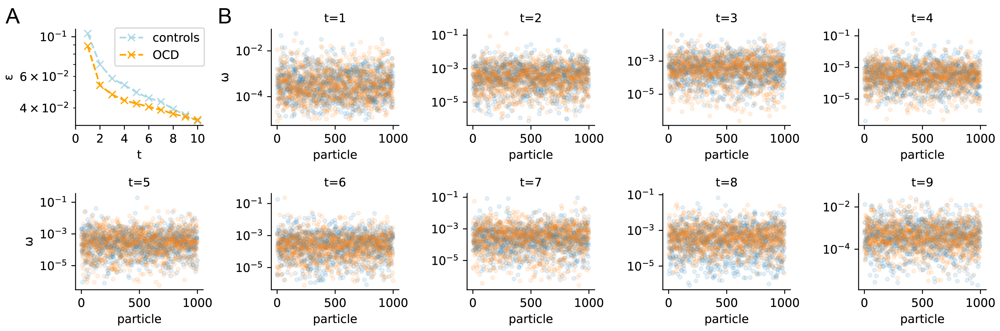
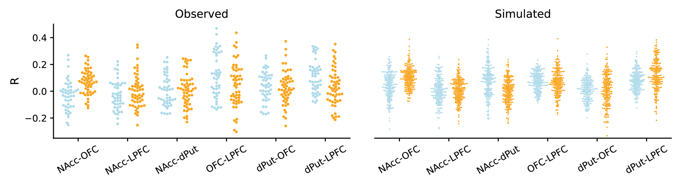
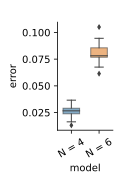

Simulation-based inference
==========================

Parameter optimization
----------------------

We perform parameter optimization using Approximate Bayesian Computation with a Sequential Monte-Carlo algorithm (ABC-SMC) \
implemented in the `pyABC`_ toolbox (Klinger et al., 2022).

We exploited the computational power offered by our high-performance computing infrastructure by instanciating a REDIS server, \
which handled the I/O and provided a lightweight database accessible by the worker nodes. 
For more information, visit https://pyabc.readthedocs.io/en/latest/api/pyabc.sampler.html#pyabc.sampler.RedisEvalParallelSampler.

Once the server is set up, we instanciate and run the ABC-SMC, which is the core class of the toolbox:
https://pyabc.readthedocs.io/en/latest/api/pyabc.inference.html

.. literalinclude:: ../../code/OCD_modeling/mcmc/abc_hpc.py
    :pyobject: run_abc

Each worker node is running simulations (Parent Processes) using parameters generated (by the Master process) and stored in the (REDIS) server. 

    Architecture of the parallel optimization.

.. autofunction:: OCD_modeling.mcmc.simulate_population_rww

The simulations are further parallelized across processes (Child Processes) within a single worker. 

.. autofunction:: OCD_modeling.hpc.launch_pool_simulations

.. autofunction:: OCD_modeling.hpc.run_sim

History analysis
----------------

Once parameters have been optimized to fit empirical data, we can visualize the posterior distributions of model's parameters.

.. autofunction:: OCD_modeling.mcmc.compute_kdes

.. autofunction:: OCD_modeling.mcmc.plot_kdes

  Plotting Kernel Density Estimates (KDEs)

We perform statistical test on those posterior distribution to extract parameters differentiating OCD subjects from healthy controls.

.. autofunction:: OCD_modeling.mcmc.compute_stats

We can also verify the meta parameters of the optimizer. Weights distributions indicate whether the sampling at the different 
generations is using a large number of particles or only a few individuals of a population (indicative of degeneracy).
Visualizing the error rate :math:`\epsilon` indicates how far is the optimization from the target value and whether 
the optimization is still progressing or plateauing. 

.. autofunction:: OCD_modeling.mcmc.plot_weights

.. autofunction:: OCD_modeling.mcmc.plot_epsilons

  [A] Error rates (:math:`\epsilon`) and [B] Weights :math:`\omega` of the optimization (blue: contols; orange:OCD).

Synthetic dataset
-----------------

We then generate new synthetic data using posterior distributions of parameters infered by the ABC-SMC algorithm.

.. autofunction:: OCD_modeling.mcmc.launch_sims_parallel

The distribution of functional connectivities across the frontostriatal system can be visualized and compared between 
empirical (observed) and simulated data.

.. autofunction:: OCD_modeling.mcmc.plot_fc_sim_vs_data

  Functional connectivity patterns across the frontostriatal system in OCD subjects (orange) vs healthy controls (blue), 
  from empirical (observed) and simulated data.

Model comparison
----------------

While the ABC-SMC optimization framework does incorporate Bayesian model selection during the optimization process,
we sometimes want to compare the performance of different optimized models post-hoc.

This task simply involves computing the error between the synthetic data generated by each model and the empirical data 
that we are optimized against.

First, load the empirical and simulated datasets:

.. autofunction:: OCD_modeling.mcmc.load_empirical_data

.. autofunction:: OCD_modeling.mcmc.load_simulations

Then, compute and plot errors:

.. autofunction:: OCD_modeling.mcmc.compute_errors

.. autofunction:: OCD_modeling.mcmc.plot_errors

  Error between simulated models (without thalamus nodes, N=4; with thalamus nodes, N=6) and empirical 
  frontostriatal connectivity data.

