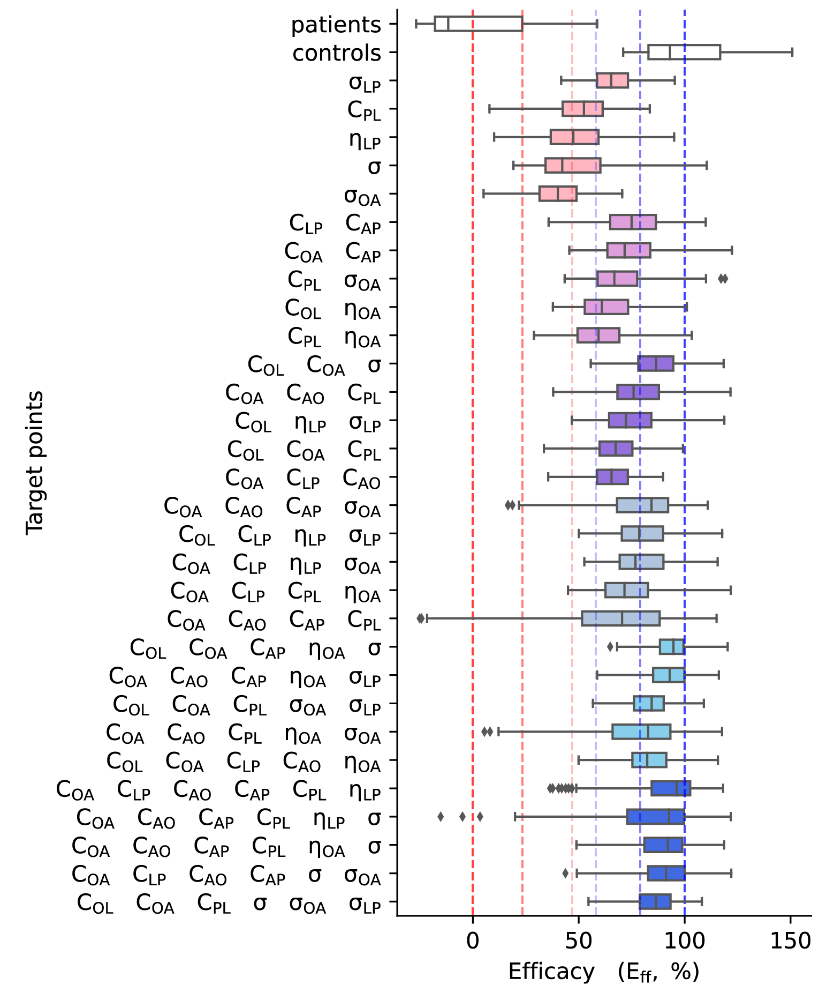
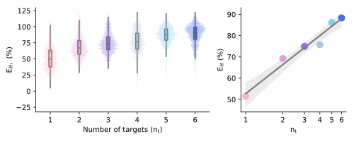
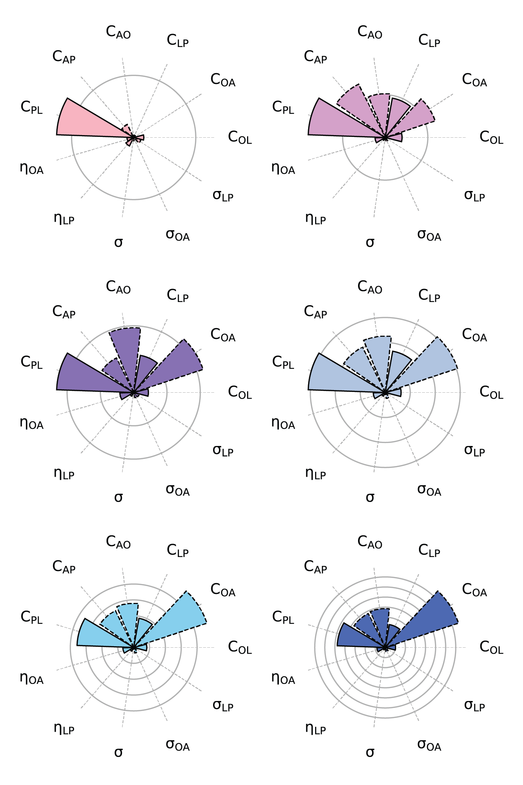

Restoration analysis
====================

The restoration analysis uses a combinatorial approach to permute all possible sets of up to six parameters at a time. 
Such combination of permuted parameters is called a **virtual intervention**. 
Default parameters are sampled from the OCD posteriors. Permuted parameters are sampled from the controls' posteriors. 
1000 simulations are run in parallel, each with a new draw from posterior distributions, for each virtual intervention.
 
Then, simulations are grouped by sets of 50 to get 20 independent cohorts for each virtual intervention.
The distance between the the virtual intervention and the reference healthy controls' simulations is evaluated 
as the sum of Waserstein distances across pathways in frontostriatal functional connectivity space.

An efficacy measure of the virtual intervention is derived from this distance through a linear transformation. 
Next, we quantify the contribution of each parameter to the overall efficacy across all virtual interventions (sorted by 
number of intervention targets). This informs about how reliably a parameter influence the restoration of healthy 
functional dynamics from OCD. 

.. note::
    Subscript notation may differ from the publication, original code uses numbered subscripts rather than letters.
    The mapping is :
    
    | 1: O --> orbito-frontal cortex (OFC)
    | 2: L --> lateral prefrontal cortex (LPFC)
    | 3: N --> nucleus accumbens (NAcc)
    | 4: P --> dorsal putamen (dPut)

    :math:`\theta_{ij}` refers to parameter :math:`\theta` to population :math:`i` from population :math:`j`. 

Combinatorial permutations
--------------------------

We save the combinations of permuted parameters on the distributed filesystem such that all workers can access it.

.. code-block::

    params = ['C_12', 'C_13', 'C_24', 'C_31', 'C_34', 'C_42', 'eta_C_13', 'eta_C_24', 'sigma', 'sigma_C_13', 'sigma_C_24']
    combinations = []
    for i in range(0,6):
        for p in itertools.combinations(params, r=i+1):
            combinations.append(p)
    print("number of parameter combinations: "+str(len(combinations)))
    with open(os.path.join(proj_dir, 'postprocessing', 'params_combinations.pkl'), 'wb') as f:
        pickle.dump(combinations, f)

.. code-block::

    >>> number of parameter combinations: 1485

Then we generate new synthetic data using the adequate posteriors from either OCD or healthy controls. 
We run 1000 simulations (20 cohorts of 50 virtual subjects) for each vitual intervention (i.e. combinations of permutations).

.. autofunction:: OCD_modeling.mcmc.launch_sims_parallel

Efficacy measure
----------------

An efficacy measure :math:`E_{ff}` of virtual interventions was derived from the Waserstein distance :math:`d_Z`, in functional connectivity space, 
between the simulated interventions and the simulated controls. 

.. math::
  E_{ff} = \left( 1 - \left(  \frac{d_Z - \widehat{\mu_d}}{\mu_{d_{XY}}} \right) \right) \times 100

with :math:`\widehat{\mu_d} = \frac{ \mu_{d_{XX}} + \mu_{d_{YY} } }{2}` where :math:`\mu_{d_{XX}}` is the average of distances
:math:`d_{XX}` in functional connectivity space within simulated controls, :math:`\mu_{d_{YY}}` is the average of distances
:math:`d_{YY}` within simulated OCD, and :math:`\mu_{d_{XY}}` is the average distance :math:`d_{XY}` between OCD and controls.

.. autofunction:: OCD_modeling.mcmc.compute_efficacy

.. autofunction:: OCD_modeling.mcmc.compute_distance_restore

.. autofunction:: OCD_modeling.mcmc.compute_distance_restore_sims

We plot the efficacy of each virtual intervention (x-axis), showing the targeted parameters on the y-axis, 
according to their number of targets (colorcode):

.. autofunction:: OCD_modeling.mcmc.plot_distance_restore

  Efficacy measures for each virtual interventions (via `plot_distance_restore` function).

We further show that the efficacy scales logarithmically with the number of targets.

.. autofunction:: OCD_modeling.mcmc.plot_efficacy_by_number_of_target

  Mean efficacy measures bu number of targets.

Contribution measure
--------------------

To relate the contribution of changes in each parameter :math:`\theta` to the overall efficacy value (using only positive 
outcome :math:`E_{ff}^+=E_{ff}\ \ iif\ E_{ff}>0)`, we scaled :math:`E_{ff}^+` by the normalized parameter change in patients:

.. math::
  \theta_{E_{ff}}=\frac{1}{N}\sum_{N}{\frac{\theta-\mu_{\theta_Y}}{s_{\theta_Y}}E_{ff}^+}

where :math:`N` is the number of cohorts in a virtual intervention, :math:`\mu_{\theta_Y}` is the mean of the parameter 
values in simulated individuals with OCD, and :math:`s_{\theta_Y}` represents the related standard deviation.

.. autofunction:: OCD_modeling.mcmc.compute_scaled_feature_score

.. autofunction:: OCD_modeling.mcmc.plot_parameters_contribution

  Contribution measures for each target colorcoded by number of targets.
