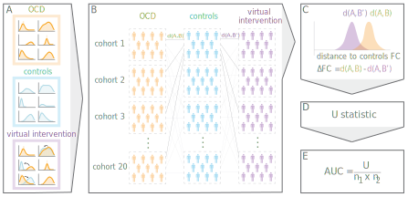
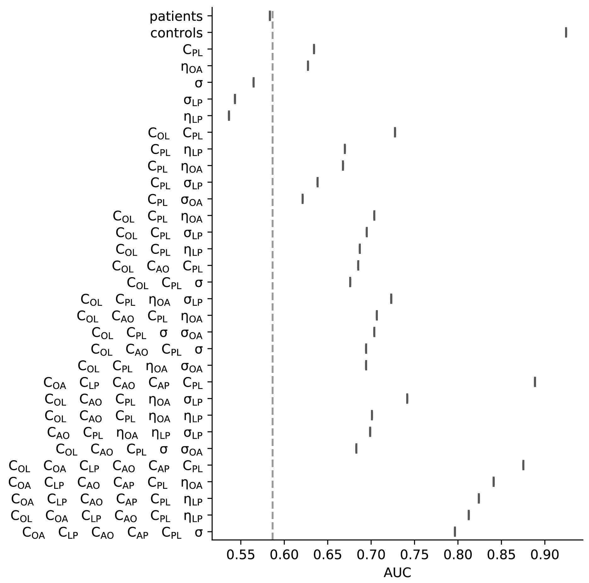
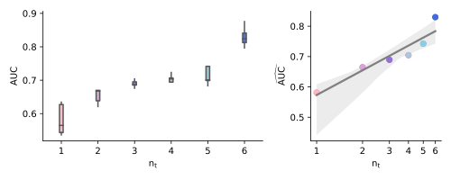
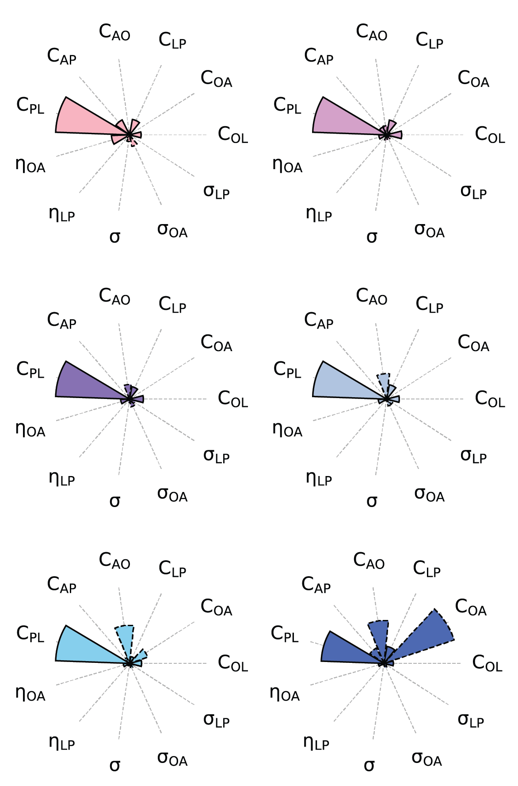

Restoration analysis
====================

The restoration analysis uses a combinatorial approach to permute all possible sets of up to six parameters at a time. 
Such combination of permuted parameters is called a **virtual intervention**. 
Default parameters are sampled from the OCD posteriors. Permuted parameters are sampled from the controls' posteriors. 
1000 simulations are run in parallel, each with a new draw from posterior distributions, for each virtual intervention.

  Generation of virtual cohorts and evaluation of virtual interventions. **A**. Parameters are drawn from OCD (orange) and 
  control (blue) posterior distributions to create 2000 reference virtual subjects, 1000 in each group. 
  Virtual interventions are modelled by drawing from the reference control group distributions for the parameters targeted 
  by the intervention and drawing from the reference distributions of the OCD group for parameters not targeted by the 
  intervention. 1000 virtual subjects are generated to create the virtual intervention cohorts. **B**. For each group, the 
  1000 virtual subjects are separated into 20 cohorts of 50 subjects. We computed functional connectivity (FC) distances 
  between all controls and OCD cohorts (:math:`d(A,B)`; i.e., reference); and all controls and virtual interventions 
  cohorts (:math:`d(A,B’)`; i.e., intervention). **C**. The distribution of FC distances between reference (orange) and 
  intervention (purple) is compared (decrease in the distance implies functional improvement). **D**. The efficacy of the 
  intervention is statistically quantified using a Mann-Whitney U test between reference and intervention distributions. 
  **E**. Normalization of the U statistic by the number of samples leads to the AUC for which scores above 0.5 denote 
  functional improvement.

Then, simulations are grouped by sets of 50 to get 20 independent cohorts for each virtual intervention.
The distance between the the virtual intervention and the reference healthy controls' simulations is evaluated 
as the sum of Wasserstein distances across pathways in frontostriatal functional connectivity space.

.. note::
    Subscript notation may differ from the publication, original code uses numbered subscripts rather than letters.
    The mapping is :
    
    | 1: O --> orbito-frontal cortex (OFC)
    | 2: L --> lateral prefrontal cortex (LPFC)
    | 3: N --> nucleus accumbens (NAcc)
    | 4: P --> dorsal putamen (dPut)

    :math:`\theta_{ij}` refers to parameter :math:`\theta` to population :math:`i` from population :math:`j`. 

Combinatorial permutations
--------------------------

We save the combinations of permuted parameters on the distributed filesystem such that all workers can access it.

.. code-block::

    params = ['C_12', 'C_13', 'C_24', 'C_31', 'C_34', 'C_42', 'eta_C_13', 'eta_C_24', 'sigma', 'sigma_C_13', 'sigma_C_24']
    combinations = []
    for i in range(0,6):
        for p in itertools.combinations(params, r=i+1):
            combinations.append(p)
    print("number of parameter combinations: "+str(len(combinations)))
    with open(os.path.join(proj_dir, 'postprocessing', 'params_combinations.pkl'), 'wb') as f:
        pickle.dump(combinations, f)

.. code-block::

    >>> number of parameter combinations: 1485

Then we generate new synthetic data using the adequate posteriors from either OCD or healthy controls. 
We run 1000 simulations (20 cohorts of 50 virtual subjects) for each vitual intervention.

.. autofunction:: OCD_modeling.mcmc.launch_sims_parallel

Intervention improvement measure
--------------------------------

A Mann-Whitney U statistic was computed to quantify the functional improvement (as the distance to healthy controls FC) of the 
virtual intervention. A normalized measure (the Area Under the receiver operating characteristic Curve -- AUC) of 
functional improvement is derived from the U statistic, and AUCs are sorted by number of intervention targets. 
This informs about how reliably parameters influence the restoration of healthy functional dynamics from OCD. 

.. autofunction:: OCD_modeling.mcmc.compute_efficacy

.. autofunction:: OCD_modeling.mcmc.compute_distance_restore

.. autofunction:: OCD_modeling.mcmc.compute_distance_restore_sims

We plot the AUC of each virtual intervention (x-axis), showing the targeted parameters on the y-axis, 
according to their number of targets (colorcode):

.. autofunction:: OCD_modeling.mcmc.plot_distance_restore

  AUC measures for each virtual interventions (via `plot_distance_restore` function).

We also show the log-linear relationship between the efficacy of the five best intervention for each number of targets.

.. autofunction:: OCD_modeling.mcmc.plot_efficacy_by_number_of_target 

  Log-linear realtionship between virtual intervention AUC and number of intervention targets :math:`n_t`.

Parameters contribution measure
-------------------------------

To relate the contribution of changes in each parameter :math:`\theta` to the interventions' AUC value (using only statistically
significant AUC, i.e. :math:`p_{FWE}<0.05`) via a dot-product between the two variables.

.. autofunction:: OCD_modeling.mcmc.compute_scaled_feature_score

.. autofunction:: OCD_modeling.mcmc.plot_parameters_contribution

  Contribution measures for each target colorcoded by number of targets.
