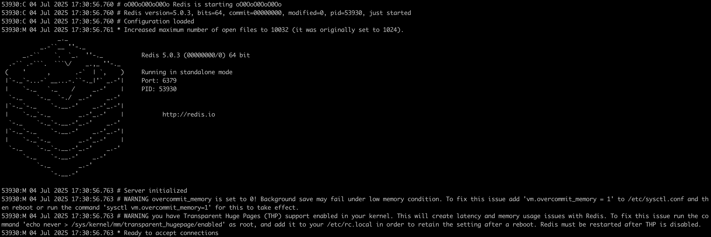
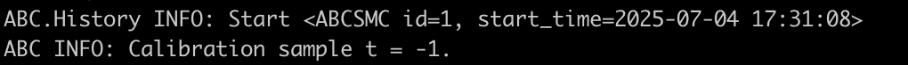
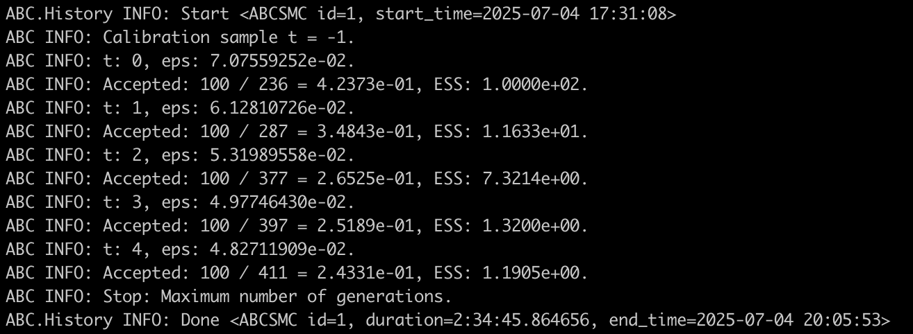
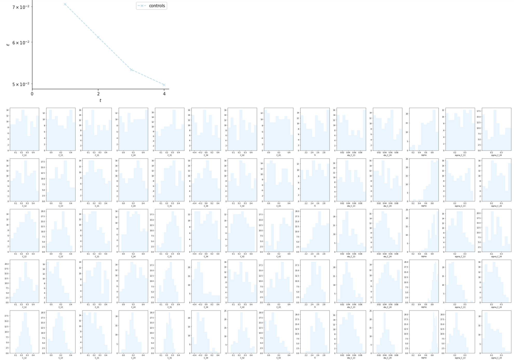

Tutorials
=========

This pages runs you through the pipeline to run a parameter optimization of our model.

.. note::  
    All commands are written as if they are performed from the project's root directory.

1) Make your you have activated the project's virtual environment::

    conda activate OCDenv


2) Edit the TOML configuration file at the root of the project folder (a file `tutorial.toml` should already be there). 
    
.. note:: 
    For example, you can change the network architecture (``default_params.model.C``), priors (``optim_params.priors.C_min_max``), 
    simulated time (``default_params.sim.t_tot``), recording time (``default_params.bold.t_range``), etc.
    

3) Start the REDIS server locally, use the REDIS configuration located in the ``config`` directory::

    redis-server ./config/redis.conf --port 6379

This should look like this:



    Screenshot of the running REDIS server. 


4) [Open a new terminal and activate virtual environment] Start the ABC-SMC main script 
(server side, i.e. only handles the optimization, not the actual simulations workload).
Provide the configuration file of the simulation you'd liek to run::

    python OCD_modeling/mcmc/abc.py --config ./config/tutorial_optimization.toml

It should look like this:



    Screenshot of the running optimization. 


5) [Open a new terminal and activate virtual environment] Start the ABC workers, i.e. the processes 
that perform the simulation::

    abc-redis-worker --host=127.0.0.1 --processes=4 --catch=False --daemon=False --runtime=8h --password=bayesopt1234321


.. note::
    Note that since by default each process spawns 8 sub-processes, this command will use 32 CPU threads. 
    You can adjust the runtime limit of the workers. If the worker reach this walltime, it will finish the simulations 
    that have already started and then stop. The optimization however does not stop until either the maximum number of generations
    or the target error (:math:`\epsilon`) are reached. 


You can see the evolution of the optimization through the output of the ```abc.py`` script and by running::
    
    abc-redis-manager info --host 127.0.0.1 --password bayesopt1234321  


On a machine with Intel Xeon Gold CPUs, the above took about 3h to run.



    Screenshot of the finished optimization. 


You now have a new ``RWW4D_OCD_Test.db`` file in the ``traces`` folder of your project directory. It is a SQL database file, 
you can export it in ``.csv`` if you'd like for further analysis or visualization, 
using the command (from the ``traces`` directory)::
    
    abc-export --db RWW4D_OCD_Test.db --out RWW4D_OCD_Test.csv --format csv --generation all


To visualize the output of the optimization, you can run the ``history_analysis.py`` script::
    
    python OCD_modeling/mcmc/history_analysis.py --config ./config/tutorial_optimization.toml --plot_epsilons --plot_param_distrib

The output should look like this:



    Visualization of the optimization output. Top plot indicates the residual error (:math:`\epsilon`).
    Bottom plot indicates the parameter distributions (columns) across the generations (rows) from first 
    (top) to last (bottom).


.. note::
    For illustration purpose, this tutorial runs a very coarse-grain version of the optimization (cohorts of 16 virtual subjects, 
    100 cohorts per generation, 5 generations) compared our publication (cohorts of 56 virtual subjects, 1000 cohorts per
    generation, 10 generations).
