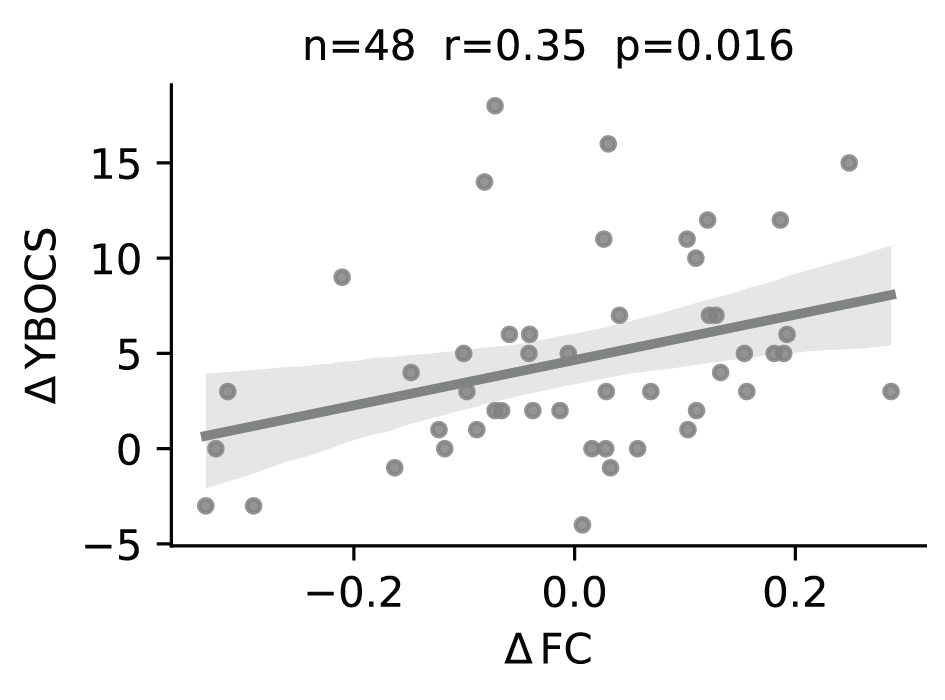
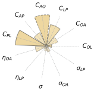
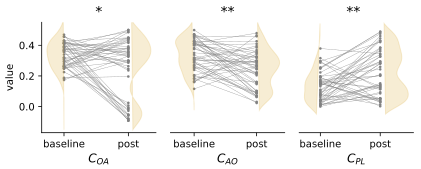
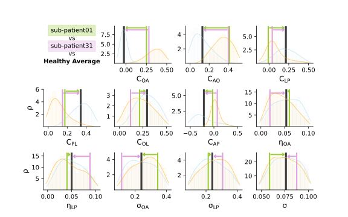

Digital twins validation
========================

Our restoration analysis predicted which intervention targets (i.e. model parameters) contribute 
the most to restore healthy frontostriatal functional dynamics, through an efficacy measure (AUC).
We test those predictions in the empirical dataset of longitudinal changes in OCD subjects. 

Behavioral *vs* functional improvement in empirical data
--------------------------------------------------------

First, we assess whether symptoms improvement over time correlate to the restoration of frontostriatal 
functional connectivity on our empirical dataset of OCD subjects. As in the virtual intervention case, 
changes in functional connectivity are computed w.r.t. distance to healthy controls connectivity.

.. autofunction:: OCD_modeling.mcmc.plot_pre_post_dist_ybocs

  Relation between improvement of functional connectivity distance to healthy controls and 
  symptom severity (Y-BOCS score) in empirical data.

Digital pairing
---------------

Then, we paired the initial and follow-up functional connectivity patterns of OCD subjects to the closest baseline 
and post-intervention simulations. The pairing was based on the Euclidian distance between the empirical functional 
connectivity value of OCD subjects and their closest simulated connectivity value (i.e. **digital twins**).

.. autofunction:: OCD_modeling.mcmc.compute_distances

Improvement analysis
--------------------

Once the digital pairing is performed, and we can associate digital twins parameters to empirical subjects 
improvements in symptoms. We then score which parameter changes covary with improvement in symptoms in our 
longitudinal dataset of OCD subjetcs, using a dot-product between the two variables.  

.. autofunction:: OCD_modeling.mcmc.score_improvement

.. autofunction:: OCD_modeling.mcmc.plot_improvement_windrose

    Normalized changes of parameters between initial (pre) and follow-up (post), scaled by symptoms improvement 
    in digital twins of OCD subjects. 

.. autofunction:: OCD_modeling.mcmc.plot_improvement_pre_post_params_paper

    Distributions of (raw) parameter evolutions between initial (pre) and follow-up (post) in digital twins of OCD subjects. 

Personalized interventions
--------------------------

We illustrate how our framework can be used for intervention prognosis using the digital twins.
Here we have two OCD subjects, patient #1 and patient #31, for whom we computed digital twins (respectively in green and purple).
Model parameters that can be used as intervention targets are on the x-axis while the y-axis denote density estmates of 
these parameters (blue: controls, orange: OCD; given as reference). Individual values of the two patients are denoted as
colorcoded vertical bars, andthe black bar is the target parameter values defined as the avergae healthy parameter value. 

Interventions could be planned to restore (i.e. increase or decrease) targeted parameters according to the direction of the 
colorcoded arrows for each OCD subject, such that their frontostriatal functional connectivity tends to the healthy regime.

  Digital twin parameters (vertical coloured lines; green: OCD \#01, purple: OCD \#31) are displayed alongside the 
  control group’s average (black vertical line). Arrows indicate the direction (arrowhead) and amplitude (vector length) 
  of the targeted changes in specific neural parameters to restore healthy neural dynamics at the individual level. 
  Posteriors distributions of OCD (orange) and controls (blue) are shown in background for reference.

To get this, we did a special call to the function below, using the individuals' digital twins patients summary row (at baseline) as `df_real`:

.. autofunction:: OCD_modeling.mcmc.plot_kdes

