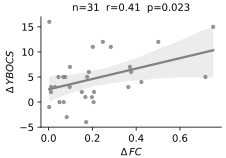
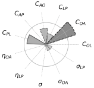
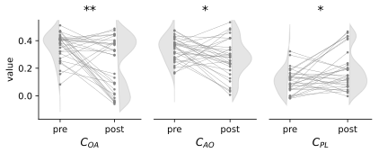

Digital twins validation
========================

Our restoration analysis predicted which intervention targets (i.e. model parameters) contribute 
the most to restore healthy frontostriatal functional dynamics, through an efficacy measure derived from 
frontostriatal functional connectivity. 

Behavioral relationship to healthy functional connectivity in empirical data
----------------------------------------------------------------------------

First, we test this efficacy measure on our empirical dataset of OCD subjects to see if symptoms improvement over time 
correlate to the restoration of frontostriatal functional connectivity closer to healthy controls.

.. autofunction:: OCD_modeling.mcmc.plot_pre_post_dist_ybocs

  Relation between functional connectivity distance to healthy controls and symptom severity (Y-BOCS score) in empirical data.

Digital pairing
---------------

Then, we paired the initial and follow-up functional connectivity patterns of OCD subjects to the closest baseline and post-intervention 
simulations. The pairing was based on the Euclidian distance between the empirical functional connectivity value of OCD subjects 
and their closest simulated connectivity value (i.e. **digital twins**).

.. autofunction:: OCD_modeling.mcmc.compute_distances

Improvement analysis
--------------------

.. autofunction:: OCD_modeling.mcmc.score_improvement

.. autofunction:: OCD_modeling.mcmc.plot_improvement_windrose

    Mean change of parameters between initial (pre) and follow-up (post) in digital twins of OCD subjects. 

.. autofunction:: OCD_modeling.mcmc.plot_improvement_pre_post_params_paper

    Distributions of parameter evolutions between initial (pre) and follow-up (post) in digital twins of OCD subjects. 